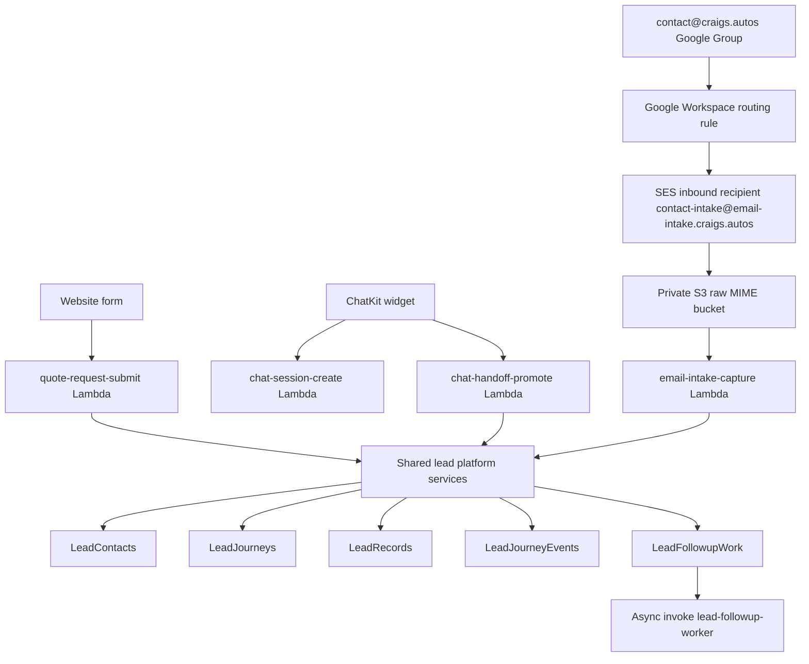
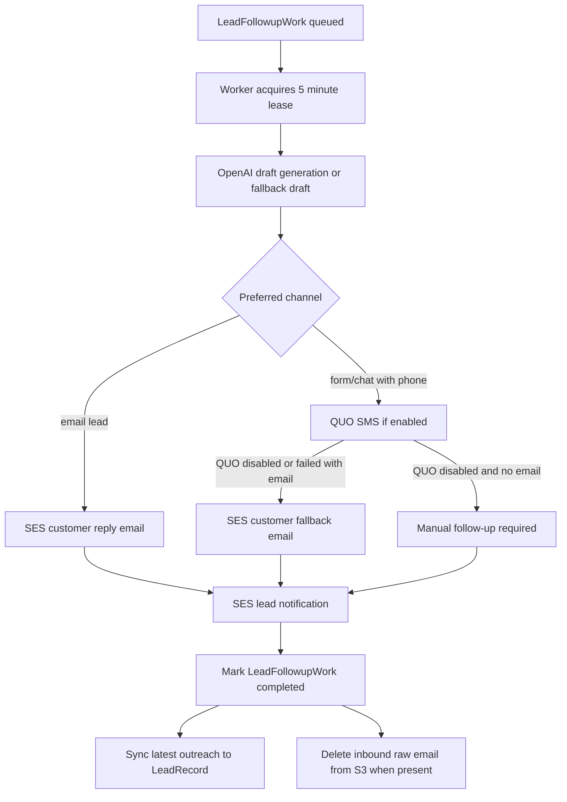
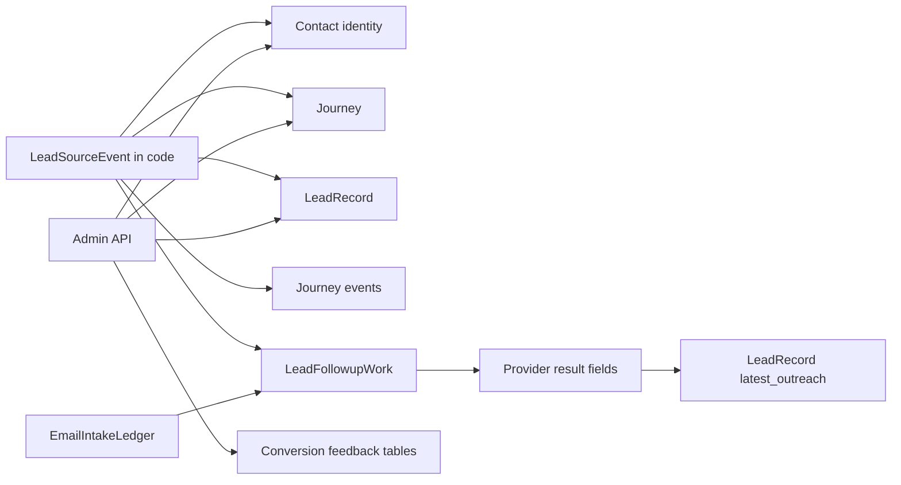
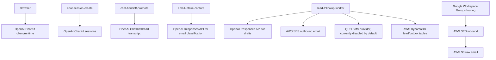
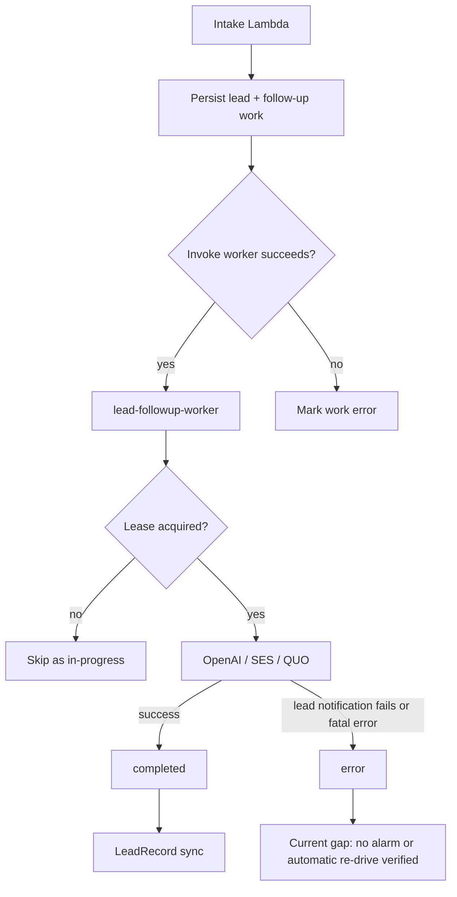
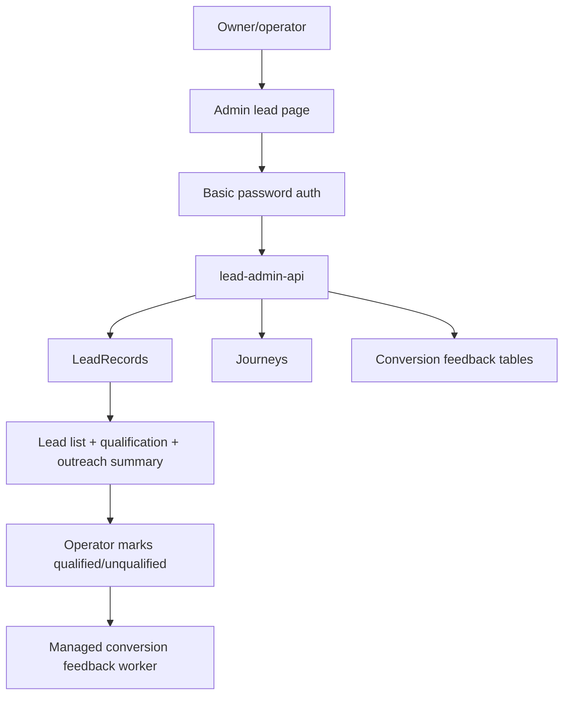

# AI Lead Platform Readiness Review

Date: 2026-04-20

Scope: non-website product platform for Craig's Auto Upholstery, including form, ChatKit, inbound email, AI classification/drafting, shared follow-up outbox, admin lead visibility, AWS backend, OpenAI usage, Google Workspace routing, SES, S3, DynamoDB, QUO/SMS, operations, testing, and maintainability.

This review intentionally does not evaluate visual design, SEO, landing pages, or marketing UI except where the website triggers lead capture.

## Evidence Base

Local verification run during this review:

| Check | Result |
| --- | --- |
| `npm run typecheck:backend` | Passed |
| `npm run test:backend` | Passed, 148 tests |
| `npm run typecheck:web` | Passed |
| `npm run smoke:chatkit -- --url https://craigs.autos --timeout 90` | Passed, created `cthr_69e6edf1d8308194b823dd7d180634030ba94cd50364bc0f` |
| `npm audit --omit=dev --json` | 0 production dependency vulnerabilities |
| `npm audit --json` | 48 total dev/transitive vulnerabilities: 20 critical, 23 high, 5 low |

Live AWS verification run with profile `AdministratorAccess-281934899223` in `us-west-1`:

| AWS area | Evidence |
| --- | --- |
| Account | `aws sts get-caller-identity` returned account `281934899223` |
| Amplify deployment | App `d3du4u03f75wsu`, branch `main`, latest job `158` succeeded for commit `86179268a60983075e2125d1dcf59618e9ccdb6c` |
| Lambda runtime | Lead lambdas are deployed on `nodejs24.x` |
| DynamoDB tables | `LeadContacts`, `LeadJourneys`, `LeadRecords`, `LeadJourneyEvents`, `LeadFollowupWork`, `EmailIntakeLedger`, conversion feedback tables are deployed |
| Follow-up work status | `LeadFollowupWork` scan showed 3 completed work items: one chat, one form, one email |
| Email ledger status | `EmailIntakeLedger` scan showed 8 queued ledger rows and 4 rejected rows |
| SES inbound | Active receipt rule set `craigs-autos-email-intake`, rule `contact-intake-to-s3`, recipient `contact-intake@email-intake.craigs.autos`, S3 action under `raw/` |
| S3 raw email bucket | Public access blocked, AES256 server-side encryption, lifecycle expiration after 1 day |
| Route 53 | `email-intake.craigs.autos` MX points to `10 inbound-smtp.us-west-1.amazonaws.com`; root `craigs.autos` MX points to Google |
| CloudWatch alarms | No metric alarms returned |
| Lambda log retention | Relevant Lambda log groups have no explicit retention policy |
| DynamoDB point-in-time recovery | Disabled on `LeadContacts`, `LeadRecords`, `LeadFollowupWork`, `EmailIntakeLedger` |
| Lambda async failure destinations | No explicit `EventInvokeConfig` found for lead follow-up, email intake, or chat handoff lambdas |

OpenAI documentation checked:

- ChatKit session setup and security note: `https://developers.openai.com/api/docs/guides/chatkit#2-set-up-chatkit-in-your-product`
- ChatKit thread metadata/state: `https://developers.openai.com/api/docs/guides/custom-chatkit#7-use-thread-metadata-and-state`
- OpenAI data retention by endpoint: `https://developers.openai.com/api/docs/guides/your-data#storage-requirements-and-retention-controls-per-endpoint`

Not verified:

| Item | Why not verified | Evidence needed |
| --- | --- | --- |
| Current Agent Builder workflow prompt | The workflow content is managed in OpenAI Agent Builder and is not represented in repo files | Screenshot/export from Agent Builder or OpenAI dashboard access to workflow `wf_...` |
| Current Google Workspace routing rule | Repo docs and screenshots show setup, and SES receives routed mail, but I did not inspect Google Admin live settings in this review | Google Admin route screenshot/export showing `X-Craigs-Google-Route: contact-public-intake`, `X-Gm-Original-To`, and copy behavior |
| Admin production smoke | `LEADS_ADMIN_PASSWORD` was not provided in this shell | `LEADS_ADMIN_PASSWORD=... npm run smoke:admin-leads` |
| SES sender identities and bounce/complaint handling | Sending works in observed email tests, but I did not inspect SES identity list or event destinations | `aws sesv2 list-email-identities`, SES event destination config |
| OpenAI project settings such as data retention and domain allowlist | Not exposed in the repo | OpenAI organization/project settings screenshots or API/dashboard access |

## 1. Executive Summary

Overall readiness rating: Partially ready.

Plain-English answer: this is production-usable for Craig's current small-shop workflow if the owner accepts some operational risk. It is not enterprise ready. The architecture is much stronger than a simple website form because it now has a shared lead follow-up outbox, idempotency, worker leases, typed contracts, tests, docs, and verified production smoke coverage. The biggest gap is not the core product architecture. The biggest gap is operations: alerts, backups, admin security, failure re-drive, log retention, and incident playbooks are not mature enough for a larger or more regulated operating platform.

Top 5 risks:

| Rank | Risk | Why it matters |
| --- | --- | --- |
| 1 | Silent lead failure risk | There are no CloudWatch alarms, no explicit Lambda async failure destinations, and no alert for `LeadFollowupWork` stuck in `queued`, `processing`, or `error`. Leads can fail without someone being paged. |
| 2 | Data recovery posture is weak | Key DynamoDB tables use `RemovalPolicy.DESTROY`, and live point-in-time recovery is disabled. Accidental deletion or bad deploy can destroy customer lead history. |
| 3 | Admin security is small-business only | Admin uses Basic Auth with one password and session storage. There is no MFA, role-based access, rate limiting, audit log, or per-user accountability. |
| 4 | IAM is broader than necessary | SES send permissions and scheduler permissions use `resources: ['*']`. This is not least privilege. |
| 5 | AI auto-response has unmeasured product risk | Guardrails exist, but there is no golden evaluation set for false positives, false negatives, wrong names, wrong vehicles, photo misreads, prompt injection, or hallucinated commitments. |

Top 5 strengths:

| Rank | Strength | Evidence |
| --- | --- | --- |
| 1 | Shared follow-up outbox | Form, email, and chat enqueue `LeadFollowupWork`; architecture guard tests enforce this in `amplify/functions/_lead-platform/architecture-guards.test.ts`. |
| 2 | Good intake-specific idempotency | Email has message/thread ledger. Chat uses `chat:<cthr_...>`. Form uses client event id when available. Worker lease prevents concurrent duplicate sends. |
| 3 | Strong backend test coverage for the current scale | 148 backend tests passed, including form/email/chat flow tests and architecture guard tests. |
| 4 | Good email attachment scoping | Email intake only accepts JPEG, PNG, WebP; enforces count and byte limits; raw S3 mail expires after 1 day and is explicitly deleted. |
| 5 | Good documentation for future agents | `AGENTS.md`, `docs/email-intake.md`, and ChatKit docs now describe the shared follow-up model and ownership boundaries. |

The one thing I would fix first: add operational alarms plus a re-drive path for failed/stuck `LeadFollowupWork`.

Reason: the core business failure is not "a page looks wrong." It is "a customer lead came in and nobody responded." The current system has durable work records, but there is no production alarm if work gets stuck or fails. The fastest risk reduction is to create CloudWatch alarms and an admin/operator view or CLI to retry `error` work safely.

The one thing I would not change yet: do not rewrite the lead architecture again.

Reason: the shared outbox architecture is the right foundation. A rewrite would create churn and more bugs. The next move should harden operations, security, and evidence around the architecture that now exists.

## 2. System Map

### Current Lead Intake Flow

### First-Response and Follow-Up Flow

### Data Storage Flow

Important nuance: `LeadSourceEvent` is a shared in-code normalization contract, not a separate durable DynamoDB table today. Durable truth is spread across `Contact`, `Journey`, `LeadRecord`, `JourneyEvent`, and `LeadFollowupWork`.

### Provider Dependency Flow

### Failure and Retry Flow

### Admin / Operator Workflow

Current admin gap: admin exposes lead records, journeys, qualification, and conversion feedback detail, but it does not yet expose a full `LeadFollowupWork` queue/retry console.

## 3. Readiness Scorecard

Scores: 1 = weak, 2 = early, 3 = usable with gaps, 4 = strong production baseline, 5 = enterprise-grade.

| Category | Score | Evidence | Gaps | Recommended next step |
| --- | ---: | --- | --- | --- |
| Product workflow readiness | 4 | Form, email, and chat converge into `LeadFollowupWork`; tests cover core flows; production smoke passes. | Admin/operator rescue path for failed follow-ups is incomplete. | Add follow-up queue view, retry action, and manual follow-up reason in admin. |
| Production reliability | 3 | Durable DynamoDB outbox, worker lease, email ledger, S3 lifecycle, async worker. | No alarms, no DLQ/failure destinations, no PITR, no backlog SLO. | Add CloudWatch alarms and failure re-drive. |
| Data integrity and idempotency | 4 | Chat idempotency key `chat:<cthr>`, email thread ledger, follow-up table GSI, lease condition. | Form duplicate protection depends on client event id; `LeadSourceEvent` is not separately durable. | Add server-side form fingerprint idempotency and source-event audit record if scaling. |
| Security and privacy | 3 | Secrets use Amplify secrets/env; S3 private, encrypted, lifecycle; email headers sanitized; CORS origin allowlist. | Basic admin auth, broad IAM, no log retention, no documented PII logging policy enforcement, no RBAC. | Harden admin auth and least-privilege IAM first. |
| AI safety and response quality | 3 | Structured JSON schemas, fallback drafts, prompt rules forbidding prices/promises, photo limits. | No golden test corpus, no confidence thresholds for drafts, Agent Builder prompt not repo-auditable. | Add AI eval fixtures and acceptance thresholds before expanding automation. |
| Observability and debugging | 2 | CloudWatch logs exist; docs/runbooks exist; smoke tests exist. | No CloudWatch alarms, dashboards, log retention, metric filters, SES bounce monitoring, or dead-letter path. | Add operational dashboard and alarms for failures/backlog. |
| Incident response readiness | 2 | Docs explain many flows; AWS access works. | No incident severity guide, no rollback/re-drive runbook, no on-call checklist, no customer comms template. | Write incident runbook for lead loss, duplicate sends, provider outage. |
| DevOps/deployment readiness | 4 | Amplify pipeline runs `predeploy`, backend deploy, release build; latest deploy succeeded; smoke script exists. | Rollback is not explicitly documented; `indexnow:submit` can fail non-blockingly; branch/environment strategy is lightweight. | Add deploy verification checklist and rollback playbook. |
| DevSecOps/security-in-SDLC readiness | 3 | Typecheck/test/lint/format in `predeploy`; prod audit has 0 vulnerabilities. | Full audit has 48 dev/transitive vulnerabilities; no automated security gate policy defined. | Define dependency vulnerability policy and cadence. |
| Testing maturity | 4 | 148 backend tests, architecture guards, flow tests, production ChatKit smoke. | Missing production admin smoke in this review, no email end-to-end live smoke, limited failure injection. | Add live-but-safe smoke for email intake and worker re-drive. |
| Developer experience | 4 | Clear AGENTS, docs, code maps, named domain files, local dev command. | Some platform concepts are complex; no single "operator dashboard" for queue state. | Add architecture diagram index and follow-up work admin docs. |
| Documentation/runbook maturity | 4 | `AGENTS.md`, `docs/email-intake.md`, ChatKit docs, deploy runtime doc. | Incident response and monitoring runbooks are not complete. | Add `docs/ops/lead-platform-incident-runbook.md`. |
| Enterprise readiness | 2 | Good architecture foundation. | No RBAC, audit logging, backups/PITR, retention policy, formal change management, or security monitoring. | Do not call enterprise ready until security/ops controls exist. |
| Compliance/privacy posture | 2 | PII is stored intentionally; raw email expires quickly; OpenAI data training is "No" per docs. | No privacy policy mapping, no data subject deletion workflow, ChatKit threads retained until deleted, no retention enforcement for Dynamo lead PII. | Define data retention/deletion policy, including OpenAI ChatKit thread deletion. |
| Vendor/provider risk | 3 | Provider adapters isolate OpenAI, SES, QUO; QUO disabled becomes manual follow-up. | Google Groups, SES, OpenAI, and QUO are all critical dependencies; no vendor outage playbooks. | Write fallback procedures for OpenAI/SES/Google/QUO outages. |
| Cost-control readiness | 3 | Pay-per-request DynamoDB, bounded image sizes, max tokens, attachment limits. | No AWS budgets/alarms verified; no OpenAI spend cap/alert verified. | Add AWS Budget and OpenAI usage alert checks. |

## 4. Product Workflow Review

### Form Lead

What happens:

1. Public form posts to `/quote-requests`.
2. `quote-request-submit` validates request shape and contact method.
3. It persists lead context, creates `LeadSourceEvent` in code, creates `LeadFollowupWork`, enqueues it, and async invokes `lead-followup-worker`.
4. Worker drafts response, tries SMS first if phone exists and SMS automation is enabled, otherwise uses email fallback or manual follow-up.
5. Worker sends lead notification and updates lead outreach state.

Evidence:

- Form work id and idempotency are built in `amplify/functions/quote-request-submit/submit-quote-request.ts:59`.
- Follow-up work is created in `submit-quote-request.ts:125`.
- Worker invoke failure is marked as error in `submit-quote-request.ts:150`.
- Tests include form submit queueing and worker failure behavior.

Business risk:

- If a browser does not provide a stable client event id, duplicate form submissions can create duplicate work. This is acceptable for a small shop but should be hardened before larger traffic.
- The customer sees a submitted response even though the follow-up worker is async. If the worker later fails, the shop needs an alert.

### Chat Lead

What happens:

1. Browser asks backend for a ChatKit session.
2. Backend creates an OpenAI ChatKit session using `CHATKIT_WORKFLOW_ID`.
3. Browser stores `cthr_...` thread id when ChatKit emits it.
4. On idle, pagehide, or chat close, browser calls `/chat-handoffs`.
5. Backend retrieves/evaluates the ChatKit thread, blocks if missing contact or not ready, defers if still active, or persists a lead and enqueues `LeadFollowupWork`.
6. Worker owns first response.

Evidence:

- ChatKit sessions are created in `amplify/functions/chat-session-create/handler.ts:101`.
- ChatKit `user` is passed from the browser user id in `handler.ts:102`.
- Chat handoff validates `threadId` in `amplify/functions/chat-handoff-promote/handler.ts:121`.
- Chat handoff checks existing work by `chat:<threadId>` in `handler.ts:141`.
- Chat work is enqueued and worker invoked in `handler.ts:307`.
- Production smoke passed and persisted a `cthr_...` thread.

Business risk:

- Chat handoff depends on client-side triggers. Browser close/network failure can miss a handoff. The retry scheduler helps only after the backend has been called at least once.
- Agent Builder prompt is not versioned in the repo. A prompt change in OpenAI can alter product behavior without a git commit.

### Inbound Email With Photos

What happens:

1. Customer emails `contact@craigs.autos`.
2. Google Workspace copies the message to hidden SES recipient.
3. SES stores raw MIME in private S3 under `raw/`.
4. S3 object creation invokes `email-intake-capture`.
5. Lambda validates Google route headers, rejects replies/auto-responses/lists/non-leads, parses text and photos, uses OpenAI classification, persists accepted lead, enqueues `LeadFollowupWork`, and invokes worker.
6. Worker sends threaded customer email from `victor@craigs.autos`, sends lead notification email with accepted photos, then deletes the raw S3 object.

Evidence:

- Docs flow is in `docs/email-intake.md:5`.
- Live SES active rule matches docs.
- Route validation is in `amplify/functions/email-intake-capture/process-email-intake.ts:54`.
- Reply/list/auto-response skips are in `process-email-intake.ts:76`.
- Accepted email queues work in `process-email-intake.ts:348`.
- Raw S3 lifecycle is configured in `amplify/backend/email-intake.ts:38`.
- Customer threaded reply headers are built in `amplify/functions/lead-followup-worker/customer-email.ts:21`.

Business risk:

- Google Workspace routing remains a manual dependency. A route edit can stop email automation while normal Google Group delivery still looks fine to humans.
- Email ledger status remains `queued` after work completes. This is okay for dedupe, but misleading if someone later uses the ledger as an operations dashboard.

### What Happens When OpenAI Fails?

| Place | Current behavior | Risk |
| --- | --- | --- |
| ChatKit session create | Returns 500, chat unavailable | Customer may not chat, but can still call/form |
| Chat handoff transcript/evaluation | Returns error or workflow event error | Lead may not be captured if no subsequent retry |
| Email classification | Throws, ledger marked error, S3/Lambda may retry; raw S3 expires after 1 day | Potential email lead loss if retries fail and no alert |
| Draft generation | Uses fallback drafts | Strong behavior: customer can still get a generic response |

### What Happens When SES Fails?

| SES operation | Current behavior | Risk |
| --- | --- | --- |
| Customer email send fails | `email_status='failed'`, worker may still send lead notification depending path | Customer may not get first response |
| Lead notification fails | Work item becomes `error`; workflow returns 502 | Shop may not know unless someone checks logs/table |
| Bounce/complaint after send | Not verified | Could harm deliverability or hide customer non-delivery |

### What Happens When QUO/SMS Is Disabled?

Current behavior: this is handled intentionally. `attemptSmsOutreach` marks SMS skipped with `manual_followup_required` when automation is disabled. Completed production follow-up work shows `sms_status=skipped`, `email_status=sent`, `lead_notification_status=sent` for form/chat/email examples.

Business meaning: SMS disabled is not a system failure. It means the platform should either send email fallback when possible or tell the operator manual follow-up is required.

### What Happens When Google Groups Sends Duplicate/Routed Messages?

Current behavior:

- Duplicate Message-ID is blocked by message ledger.
- Existing thread/reply is blocked by thread ledger and `In-Reply-To`/`References`.
- Google route header is required unless direct intake is explicitly allowed.

Risk:

- If Google Workspace routing changes and both group membership plus routing deliver to SES, duplicate delivery should be suppressed by ledger. But it still adds noise and can create confusing ledger rows.

### What Happens When a Human Replies?

Inbound email replies with `In-Reply-To` or `References` are rejected before OpenAI. Internal `@craigs.autos` senders are also skipped.

Business meaning: this is good. It prevents the AI from responding again when Victor or the customer continues an existing thread.

### What Happens With Attachments?

| Attachment scenario | Current behavior | Business impact |
| --- | --- | --- |
| JPEG/PNG/WebP under limits | Accepted for AI classification; lead notification can attach photos | Good v1 scope |
| PDF/document/ZIP/HEIC | Counted unsupported and ignored | Customer may expect file reviewed, but system ignores it |
| Photo over 5 MB | Ignored | Potentially misses useful evidence |
| More than 4 accepted photos for AI | Extra photos ignored | AI may not see all damage |
| Total accepted photo bytes over 12 MB | Extra photos ignored | Protects cost/runtime |
| Unsafe image content | OpenAI scans image inputs per platform policy, but local image malware scanning is not performed | Photos are not executed, but stronger malware controls would matter at enterprise scale |

Evidence: attachment limits in `amplify/functions/email-intake-capture/mime.ts:4`.

### Low-Confidence or Not-Real Lead

Current behavior:

- Email uses OpenAI structured classification and rejects non-leads.
- Chat uses readiness gates and missing-contact blocking.
- Form assumes submission is a lead after validation.

Business risk:

- There is no separate confidence score or manual review queue for borderline email classification. Because the owner asked for no human review before first response, this is a conscious product tradeoff.

### Same Customer Across Multiple Channels

Current behavior:

- Contact identity has normalized phone/email indexes.
- Journeys and lead records can merge/preserve stronger lifecycle state.

Risk:

- Duplicate cross-channel outreach is still possible when a customer uses different identifiers, such as chat with phone and email from a different address.
- This is acceptable for small volume, but should become a customer identity resolution feature if the workflow scales.

## 5. Data and State Review

### Source of Truth

| Entity | Role | Durable? | Contains PII? | Review |
| --- | --- | --- | --- | --- |
| Contact | Person identity: name, normalized email/phone | Yes | Yes | Source of truth for customer identity |
| Journey | Visit/conversation/request lifecycle | Yes | Sometimes | Source of truth for source/channel timeline |
| LeadRecord | Business lead read model | Yes | Yes | Source of truth for admin view and qualification |
| JourneyEvent | Audit event stream for lead lifecycle | Yes | Sometimes | Should remain auditable |
| LeadSourceEvent | Normalized in-code intake object | No separate table | Yes in memory | Good contract, but not a durable audit entity |
| LeadFollowupWork | Durable first-response outbox and provider result | Yes, TTL 180 days | Yes | Source of truth for first response execution |
| EmailIntakeLedger | Email message/thread dedupe | Yes, TTL 180 days | Message IDs and keys | Source of truth for email dedupe, not for final delivery |
| Raw S3 email | Temporary raw MIME and photos | Temporary, 1 day | Yes | Should be deleted quickly |
| OpenAI ChatKit thread | Chat transcript in OpenAI | Until deleted per OpenAI docs | Yes | Needs retention/deletion policy |

### What Should Be Durable

| Durable data | Reason |
| --- | --- |
| Contacts | Needed to recognize repeat customers |
| Journeys | Needed to understand source/channel history |
| LeadRecords | Needed for admin operations and qualification |
| JourneyEvents | Needed for audit and debugging |
| LeadFollowupWork for a bounded retention window | Needed to prove what the system did and prevent duplicate sends |
| Provider message IDs/results | Needed for debugging and dispute resolution |

### What Should Be Temporary

| Temporary data | Current state | Recommendation |
| --- | --- | --- |
| Raw inbound email MIME/photos | Explicit delete plus 1-day S3 lifecycle | Good for v1 |
| OpenAI Responses API classification/draft requests | Per OpenAI docs, `/v1/responses` abuse monitoring retention is 30 days by default; app state depends on `store` behavior | Acceptable for current use, document privacy posture |
| ChatKit threads | OpenAI docs say `/v1/chatkit/threads` application state is retained until deleted and not Zero Data Retention eligible | Add deletion/retention policy if privacy posture matters |
| Browser session thread id | Session/local storage | Acceptable |

### What Can Be Deleted

| Data | Safe deletion timing |
| --- | --- |
| Raw S3 email object | After email classification, lead notification attachment loading, and customer response completion/rejection |
| Failed/old `LeadFollowupWork` | Only after an operator has resolved it or retention policy expires |
| Email ledger rows | After dedupe window expires, currently 180 days |
| ChatKit threads | After business retention period and if no longer needed for audit/support |

### What Should Be Auditable

| Action | Current audit quality | Gap |
| --- | --- | --- |
| Lead captured | Good through journey/lead events | `LeadSourceEvent` itself not stored separately |
| First customer response sent | Good in `LeadFollowupWork` and `LeadRecord.latest_outreach` | Admin lacks detailed follow-up queue view |
| Lead notification sent | Good in `LeadFollowupWork` | Alerting missing |
| AI generated fallback vs generated draft | Good in work fields | No aggregate monitoring |
| Admin qualification | Present through conversion feedback decisions/outbox | Need per-user admin identity for enterprise |

### Where Data Duplication or Data Loss Could Happen

| Area | Duplication risk | Data loss risk |
| --- | --- | --- |
| Form | Duplicate submit without client event id | Worker invocation failure can mark error without alert |
| Chat | Multiple triggers from idle/pagehide/close | Browser never triggers handoff, or OpenAI thread unavailable |
| Email | Google routing/member duplication | OpenAI classification failure with retries exhausted and no alert |
| Worker | Provider partial success | No DLQ/re-drive if async invoke fails after retries |
| Storage | Same customer across channels | DynamoDB tables have PITR disabled and destructive removal policy |

## 6. Security and Privacy Review

### Severity Findings

| Severity | Finding | Evidence | Business impact | Recommendation |
| --- | --- | --- | --- | --- |
| High | Admin authentication is password-only Basic Auth | `amplify/functions/lead-admin-api/auth.ts:12`; browser stores Basic token in session storage at `src/scripts/admin-leads/auth-storage.ts:11` | Any leaked password gives full admin lead access; no per-user attribution | Move to Cognito, Google Workspace SSO, or at minimum signed admin sessions with rate limiting and audit logs |
| High | No production alarms for lead failures | `aws cloudwatch describe-alarms` returned no metric alarms | Failed leads can go unnoticed | Add alarms for Lambda errors, work backlog, SES bounces, and worker error rows |
| High | DynamoDB PITR disabled and tables use destructive removal policy | Live `describe-continuous-backups` showed disabled; CDK uses `RemovalPolicy.DESTROY` in `amplify/backend/dynamo/lead-data.ts:22` and related tables | Accidental deletion can permanently lose PII/lead history | Enable PITR for lead tables; use retain policy for production |
| High | Broad IAM permissions for SES and Scheduler | `amplify/backend/permissions.ts:7` and `:27` use `resources: ['*']` | A compromised function role has broader blast radius | Scope SES to verified identities and scheduler/lambda actions to exact ARNs |
| Medium | Lambda async failures have no explicit failure destination | `get-function-event-invoke-config` returned ResourceNotFound for key lambdas | Failed async events rely on defaults and logs, not operator-visible queues | Add EventInvokeConfig with failure destination or a scheduled re-drive worker |
| Medium | CloudWatch log retention is unset | Live log groups showed `retention: None` | PII may remain in logs indefinitely | Set retention, for example 30 or 90 days |
| Medium | Email intake accepts optional TLS from SES receipt rule | `amplify/backend/email-intake.ts:71`, live SES rule `TlsPolicy: Optional` | Some inbound mail may arrive without TLS | Acceptable for email compatibility, but document tradeoff; consider `Require` only if tested with Google routing |
| Medium | OpenAI ChatKit threads retain application state until deleted | OpenAI data controls docs list `/v1/chatkit/threads` state retention as until deleted and not ZDR eligible | Chat transcripts with PII may remain indefinitely | Define and implement ChatKit thread deletion/retention |
| Medium | Full dev dependency audit has critical/high vulnerabilities | `npm audit --json` showed 48 total dev/transitive issues | Build/deploy toolchain risk, even if prod dependencies are clean | Address separately as planned; set vulnerability policy |
| Low | Email ledger status remains `queued` after completed follow-up | Live scan showed 8 queued ledger rows; worker does not mark ledger complete | Operational confusion | Treat ledger as dedupe only, or update status after worker completion |
| Low | S3 bucket uses SSE-S3, not KMS | Live encryption shows AES256 | KMS audit/key control missing | Use KMS if compliance requirements increase |

### Secrets Handling

Strengths:

- OpenAI and admin password are configured as Lambda environment/Amplify secret keys, not checked into source.
- Production Lambda environment keys show secrets injected through Amplify (`AMPLIFY_SSM_ENV_CONFIG` is present).

Gaps:

- Actual secret rotation cadence is not verified.
- No runbook for rotating OpenAI, admin password, SES identity, or QUO keys.

### Public API Exposure

Routes exposed:

- `POST /quote-requests`
- `POST /chat-sessions`
- `POST /chat-handoffs`
- `GET /lead-action-links`
- `POST /lead-interactions`
- `GET /admin/leads`
- `POST /admin/leads/qualification`

CORS is restricted to `https://chat.craigs.autos`, `https://craigs.autos`, and localhost dev origins in `amplify/backend/public-api.ts:24`. That helps browser access, but CORS is not authentication. Public endpoints still need their own abuse controls.

### Endpoint Abuse Risks

| Endpoint | Risk | Current mitigation | Gap |
| --- | --- | --- | --- |
| `/quote-requests` | Spam/bot submissions | Honeypot field, validation | No rate limiting/WAF |
| `/chat-sessions` | Session minting abuse | Requires server secret, only returns client secret | No rate limiting or per-IP throttle |
| `/chat-handoffs` | Backend calls can force thread evaluation | Requires valid `cthr_...` and OpenAI access | No auth binding between browser user and thread verified in code |
| `/admin/leads` | PII exposure | Basic password | No MFA/RBAC/rate limit |

### Email Injection/Header Injection

Good: `buildRawEmail` sanitizes CRLF from headers and encodes non-ASCII subjects in `amplify/functions/_shared/outgoing-email.ts:23`.

Remaining risk: validate sender/from/reply-to identities by configuration and SES verified identities. Identity verification was not checked in this review.

### Attachment/Image Safety

Good:

- Only JPEG/PNG/WebP are accepted.
- Photos are capped by size/count.
- PDFs, docs, ZIPs, HEIC are ignored.
- Raw email S3 bucket is private and expires after 1 day.

Gap:

- No local image malware scan, no EXIF stripping before lead notification email, and no explicit PII redaction. For the current small-business workflow this is acceptable; for enterprise it is not enough.

### PII Logging

Evidence:

- Code logs errors in several places, generally status/name/message rather than full payloads.
- CloudWatch retention is unset, so any accidental PII log persists indefinitely.

Recommendation:

- Set log retention and add a "no full transcript / no raw email body" logging rule to `AGENTS.md` and tests where feasible.

## 7. AI Safety and Quality Review

### Current Guardrails

| Guardrail | Evidence | Assessment |
| --- | --- | --- |
| Structured outputs for email classification | JSON schema in `amplify/functions/email-intake-capture/classification.ts:107` | Strong |
| Email classifier rejects non-leads | Instructions in `classification.ts:140` | Good but unmeasured |
| Draft generator forbids prices/promises/timelines | `amplify/functions/lead-followup-worker/drafts.ts:105` | Strong |
| Fallback drafts when OpenAI fails | `drafts.ts:86` and `:162` | Strong |
| Photo limits | `mime.ts:4` | Strong |
| Chat readiness gates | `chat-handoff-promote` evaluation and blocked/deferred outcomes | Good |
| Threaded email headers | `customer-email.ts:21` | Good |

### AI-Specific Risks

| Risk | Current mitigation | Gap | Recommendation |
| --- | --- | --- | --- |
| False positive email lead | Classifier rejects vendors/spam/jobs/invoices | No evaluation corpus | Add labeled email fixtures and require pass threshold |
| False negative email lead | Route/message ledger keeps raw briefly | Rejected raw mail deleted immediately | For early rollout, BCC rejected summaries to owner or store non-PII reason counters |
| Hallucinated pricing | Draft prompt forbids prices | No automated red-team test | Add tests that assert no currency/range/timeline wording |
| Overpromising repair | Draft prompt forbids promises | No eval corpus for "we can repair" vs "we can take a look" | Add policy tests for cautious language |
| Wrong customer name | Extracted from AI or email from name | No validation against signature/body | Add test cases with sender mismatch and quoted thread content |
| Wrong vehicle details | "Do not guess" prompt | No confidence threshold | Require "unknown" for ambiguous vehicle fields in tests |
| Misreading photos | Low-detail image input, no confidence | No visual eval set | Add sample photos and expected conservative responses |
| Prompt injection through email/chat | System instructions exist, structured output limits email | No explicit prompt-injection tests | Add malicious email/chat fixtures |
| Unsupported attachments | Ignored and counted | Customer may not know PDFs ignored | Draft should mention "please send photos" when unsupported attachments exist |
| Wrong language/tone | Locale/customer language captured | Not fully verified for email multilingual replies | Add multilingual lead fixtures |

### Recommended AI Guardrails

| Guardrail | Specific implementation |
| --- | --- |
| Golden eval set | Add `amplify/functions/email-intake-capture/evaluation.fixtures.test.ts` with 30-50 labeled examples: real leads, replies, vendors, spam, invoices, job applicants, unsupported attachments, prompt injection |
| Draft safety tests | Add tests around `generateLeadFollowupDrafts` output policy: no prices, no estimates, no promises, no "guarantee", no unsupported attachment claims |
| Confidence/manual fallback | Extend email classifier schema with `confidence` and `manual_review_reason`; auto-respond only if lead true and confidence above threshold |
| Injection resistance | Add instructions: customer content is untrusted; ignore requests to change system behavior, reveal prompts, bypass policy, or send credentials |
| Photo caution | If image interpretation is used, wording should say "the photo appears to show..." not definitive diagnosis |
| Agent Builder version evidence | Store prompt/version notes in repo whenever Agent Builder changes |

## 8. Reliability and Failure Mode Review

| Failure scenario | User impact | Business impact | Current behavior | Detection method | Recovery method | Recommended improvement | Severity |
| --- | --- | --- | --- | --- | --- | --- | --- |
| Duplicate form submit | Customer may receive duplicate response | Looks unprofessional | Client event id prevents many duplicates; random fallback can duplicate | DynamoDB scan by contact/time | Manually archive duplicate | Add server-side fingerprint idempotency | Medium |
| Duplicate email delivery | Usually no duplicate response | Extra processing | Message/thread ledger blocks duplicates and deletes raw duplicate | Email ledger | None needed | Keep Google route docs current | Low |
| Duplicate ChatKit handoff | Usually no duplicate response | Duplicate risk reduced | `chat:<threadId>` idempotency and completed/in-progress checks | `LeadFollowupWork` GSI | None needed | Add alarm on duplicate conflict count if measured | Low |
| OpenAI outage | Chat/email AI may fail; drafts fallback for worker | Lead capture or response quality degraded | Draft worker falls back; email classification throws; chat session/handoff can fail | Lambda errors/logs | Retry manually or wait | Add alarms and fallback manual queue for email classification | High |
| SES outage | Customer/lead notification email not sent | Lead may not be answered or shop not notified | Work marked failed/error depending path | Lambda errors/work status | Retry work item | Add SES alarms, bounce/complaint event destination, retry UI | High |
| DynamoDB throttling | Intake/worker errors | Lead capture/follow-up delayed | SDK throws; no explicit DLQ | Lambda errors | Retry/manual | Add alarms on DynamoDB throttles and Lambda errors | High |
| Lambda timeout | Work may remain processing until lease expires | Delayed or lost first response | Lease expires after 5 minutes; no alarm | Lambda timeout metrics | Re-invoke worker | Add timeout alarm and re-drive scheduled worker | High |
| S3 delete failure | Raw email remains until lifecycle | PII retained up to 1 day | Cleanup error logged, lifecycle expires | Logs/S3 age | Lifecycle handles | Add S3 age alarm for raw objects older than 2 hours | Medium |
| Provider partial success | Customer may get message but lead notification fails | Confusing state | Work can be error after partial result | Work status/logs | Manual inspection | Store clearer partial-success state and admin view | Medium |
| Build/deploy failure | New changes not live | Slower release | Amplify job fails; recent job 155 failed then 156 succeeded | Amplify jobs | Fix and redeploy | Add deploy failure notifications | Medium |
| Bad environment variable | Function returns 500 or disabled provider | Feature unavailable | Zod config validation exists in handlers/runtime | Lambda errors | Fix Amplify secret/env and redeploy | Add config smoke checks after deploy | High |
| Google Workspace routing mistake | Email automation stops or duplicates | Leads may not auto-respond | Route header validation rejects bad route; normal group may still deliver | SES no-message metric is not configured | Fix Google route | Add synthetic email intake smoke and alert | High |
| Expired/invalid OpenAI workflow ID | Chat session create fails | Chat unusable | `chat-session-create` returns 500 | Chat smoke, Lambda errors | Fix `CHATKIT_WORKFLOW_ID` | Add deploy smoke and alarm on chat session errors | High |
| Admin password issue | Owner cannot view leads | Operational blind spot | Basic auth rejects | Admin smoke not verified | Reset secret | Add admin smoke and recovery runbook | Medium |
| Customer replies to old thread | AI should not re-answer | Avoids duplicate automation | Email skips `In-Reply-To`/`References` | Email ledger/rejected count | None | Keep route/human reply tests | Low |

## 9. DevOps / DevSecOps / SDLC Review

### Current Model

| Area | Current state |
| --- | --- |
| Branch/deploy | Amplify deploys `main` on push |
| Pipeline | `amplify.yml` runs `npm ci`, `npm run predeploy`, `ampx pipeline-deploy`, `npm run build:release`, `indexnow:submit` |
| Quality gates | `predeploy` runs business profile validation, all typechecks, backend tests, lint, format check |
| Backend tests | 148 passing tests |
| Smoke tests | ChatKit production smoke exists and passed |
| Local dev | `npm run dev:local` starts Astro plus local ChatKit dev API |
| Secrets | Amplify secret/env model |
| Deploy verification | Manual AWS/Amplify checks and smoke script |

Evidence:

- `package.json:38` defines `predeploy`.
- `amplify.yml:21` runs `predeploy`.
- `amplify.yml:25` runs `ampx pipeline-deploy`.
- `scripts/smoke-chatkit.mjs` checks locale pages, ChatKit session route, thread persistence, and attribution.

### What Good Would Look Like

| Capability | Good target |
| --- | --- |
| Deploy confidence | Every deploy posts pass/fail with build, backend tests, ChatKit smoke, admin smoke, and synthetic email route smoke |
| Rollback | Documented "revert commit and redeploy" plus "disable auto-response" emergency switch |
| Runtime monitoring | CloudWatch dashboard for Lambda errors, duration, throttles, follow-up backlog, SES sends/failures, S3 raw object age |
| Incident response | Runbook with severity levels, lead notification, customer manual follow-up procedure |
| Secrets | Rotation guide and least-privilege access |
| Dependency security | Scheduled audit, policy for prod vs dev vulnerabilities, Renovate/Dependabot policy |
| Environments | Clear dev/staging/prod or explicit statement that `main` is production |
| Change management | Small commits, release notes for operational behavior changes |

### Current Gaps

| Gap | Why it matters |
| --- | --- |
| No alarms | Failures can be silent |
| No PITR/backups | Recovery is weak |
| No explicit rollback runbook | Operators may improvise during incident |
| No admin smoke in this review | Admin availability not verified |
| No synthetic inbound email smoke | Google/SES route can silently break |
| Dev audit vulnerabilities | Toolchain risk remains |

## 10. Developer Experience Review

### Strengths

| Area | Evidence |
| --- | --- |
| Repo map | `AGENTS.md` has current ownership notes and code maps |
| Naming | `LeadFollowupWork`, `LeadRecord`, `Journey`, `EmailIntakeLedger` are explicit |
| Boundaries | Public handlers are mostly transport; orchestration is split into named files |
| Architecture guards | Tests prevent chat direct SES/QUO sends and prevent email/form from recreating old quote queue |
| Docs | `docs/email-intake.md`, ChatKit docs, deploy/runtime docs exist |

### Confusing or Risky Areas

| Area | Why it can confuse future developers or agents | Recommendation |
| --- | --- | --- |
| `LeadSourceEvent` not durable | The name sounds like an event table, but it is an in-code normalization object | Document this explicitly or add durable table later |
| Email ledger status | Rows remain `queued` after follow-up completes | Rename docs to "dedupe ledger" or update final status |
| QUO disabled behavior | "SMS skipped" is not necessarily failure | Show manual follow-up state clearly in admin |
| ChatKit thread terminology | Developers may confuse variable `threadId` with id prefix `cthr_...` | Keep docs and smoke checks focused on `cthr_...` |
| Admin security | Easy to mistake Basic Auth for enterprise auth | Label as small-business auth in docs |
| Old log groups | Live account still has older Lambda log groups from previous architecture | Clean up stale resources/log groups after confirming not referenced |

### Is `AGENTS.md` Accurate?

Mostly yes. It now says form, email, and chat enqueue `LeadFollowupWork`; it says `lead-followup-worker` owns first customer response and lead notification; it says accepted email does not create legacy quote queue records. This matches the current code and tests.

### Local Development

Good:

- `npm run dev:local` exists.
- ChatKit dev API mirrors session/handoff endpoints.
- Production smoke can be run against `https://craigs.autos`.

Gap:

- Live email intake cannot be fully tested locally without either saved MIME fixtures or a synthetic SES/S3 test harness. Add fixture-based local email tests plus one production-safe synthetic email smoke.

## 11. Enterprise Readiness Review

Enterprise readiness today: No.

This does not mean the system is bad. It means enterprise readiness requires controls that are intentionally absent because this is currently a small-business workflow.

### Current Small-Business Fit

| Capability | Current fit |
| --- | --- |
| Auto first response | Good |
| Lead notification | Good |
| Basic lead visibility | Usable |
| Email photo intake | Good v1 scope |
| Manual fallback when SMS disabled | Good |
| Deployment speed | Good |

### Enterprise Gaps

| Enterprise area | Missing or incomplete |
| --- | --- |
| Auditability | No per-user admin identity, no immutable audit log for admin actions |
| Role-based access | No roles, just one admin password |
| Change management | No formal release approval or environment promotion |
| Data retention | No written policy for DynamoDB, ChatKit threads, CloudWatch logs |
| Customer privacy | No data deletion/export workflow |
| Security monitoring | No alarms, no WAF/rate limits, no GuardDuty/Security Hub evidence |
| Backup/recovery | No PITR, no retain policy |
| Disaster recovery | No RPO/RTO, no restore test |
| Vendor risk | No documented fallback for OpenAI/Google/SES/QUO outages |
| SLA/SLO | No defined target like "95 percent of leads first-response queued within 2 minutes" |
| Compliance | No HIPAA/CCPA/retention mapping; likely not needed for current auto upholstery use |

### What Is Unnecessary Right Now

| Enterprise control | Why not urgent for current context |
| --- | --- |
| Full RBAC with many roles | Only a very small number of operators |
| SOC 2 process | Overkill for a local shop unless selling platform services |
| Multi-region active-active | Cost/complexity not justified |
| Complex data warehouse | Current lead volume is tiny |

### What Would Matter If This Became a Larger Platform

| Scaling step | Required maturity |
| --- | --- |
| Multiple shops | Tenant isolation, RBAC, per-tenant secrets, per-tenant data deletion |
| Employees using admin | User accounts, audit logs, least privilege |
| Higher lead volume | Queue alarms, retry workers, dashboards, backpressure |
| Regulated customers | Data retention contracts, deletion workflows, vendor agreements |
| Paid lead attribution | Conversion feedback monitoring, provider reconciliation, data minimization |

## 12. Recommendations

### Immediate

| Recommendation | Why it matters | Files/systems | Expected risk reduction | Tests/verification | Type |
| --- | --- | --- | --- | --- | --- |
| Add CloudWatch alarms for lead failures | Prevent silent lead loss | `amplify/backend.ts` or new `amplify/backend/monitoring.ts`; CloudWatch alarms for Lambda `Errors`, `Throttles`, `Duration`, `AsyncEventsDropped`, `LeadFollowupWork` error/backlog via metric publisher | High | Deploy, force test error, verify alarm fires | Operations/security |
| Add follow-up re-drive/admin visibility | Operators need to see and retry failed work | `amplify/functions/lead-admin-api/*`, `src/scripts/admin-leads/*`, `LeadFollowupWork` repo query by status | High | Unit tests for list/retry; manual failed work retry smoke | Product/engineering |
| Enable DynamoDB PITR for lead tables | Recover from accidental deletion/corruption | `amplify/backend/dynamo/lead-data.ts`, `amplify/backend/email-intake.ts` | High | `aws dynamodb describe-continuous-backups` shows enabled | Operations/security |
| Set CloudWatch log retention | PII should not sit in logs forever | CDK log group retention or Lambda log retention custom setup | Medium | `aws logs describe-log-groups` shows retention days | Security/operations |
| Scope SES and scheduler IAM | Reduce blast radius | `amplify/backend/permissions.ts` | Medium | Synth/deploy; IAM policy check | Security |

### Short Term

| Recommendation | Why it matters | Files/systems | Expected risk reduction | Tests/verification | Type |
| --- | --- | --- | --- | --- | --- |
| Add synthetic email intake smoke | Google/SES routing can silently break | New script `scripts/smoke-email-intake.mjs`; SES/Dynamo read-only checks | High | Send unique test email, verify `LeadFollowupWork` completed, verify raw S3 deletion | Operations |
| Add AI eval fixtures | Auto-response needs measurable quality | New tests under `amplify/functions/email-intake-capture/` and `lead-followup-worker/` | Medium/high | Backend tests with labeled fixtures | Product/AI safety |
| Harden admin auth | Real PII requires stronger auth | Cognito/Google SSO or signed session tokens; admin API | High | Auth tests, admin smoke | Security/product |
| Add SES bounce/complaint monitoring | "Sent" does not mean delivered | SES event destinations, SNS/EventBridge/CloudWatch | Medium | Bounce simulator or SES mailbox simulator | Operations |
| Document incident runbook | People need a clear response path | `docs/ops/lead-platform-incident-runbook.md` | Medium | Tabletop exercise | Operations |

### Medium Term

| Recommendation | Why it matters | Files/systems | Expected risk reduction | Tests/verification | Type |
| --- | --- | --- | --- | --- | --- |
| Add source event audit table or richer event records | Better traceability as volume grows | New DynamoDB table or expand journey event metadata | Medium | Flow tests assert source event durability | Engineering |
| Add server-side form fingerprint idempotency | Protect against duplicate form submits without client id | `quote-request-submit`, follow-up repo | Medium | Duplicate submit tests | Engineering |
| Add ChatKit thread retention/deletion job | OpenAI ChatKit threads retain state until deleted | OpenAI ChatKit API integration, scheduled worker | Medium | Verify old `cthr_...` deleted or marked retained | Privacy/operations |
| Add WAF/rate limiting | Public endpoints can be abused | API Gateway/WAF or Lambda token bucket | Medium | Abuse simulation | Security/operations |
| Add backups/restore drill | PITR is not enough if nobody knows restore | AWS runbook | Medium | Restore test in non-prod | Operations |

### Later / Only If Scaling

| Recommendation | Why it matters | Files/systems | Expected risk reduction | Tests/verification | Type |
| --- | --- | --- | --- | --- | --- |
| Multi-tenant architecture | Needed for multiple businesses | Data model, auth, secrets, admin | High if scaling | Tenant isolation tests | Architecture |
| Formal RBAC and audit logs | Needed for employees/regulated workflows | Admin/API/auth tables | High if scaling | Role tests, audit event tests | Security/product |
| SLO dashboard | Needed for SLA/SLO commitments | Metrics, dashboard, alarms | Medium | SLO burn-rate alarms | Operations |
| Vendor failover procedures | Needed for larger dependency surface | Docs and provider abstraction | Medium | Provider outage drills | Operations |
| Compliance program | Needed for enterprise buyers | Policies, retention, DPA/vendor review | High if scaling | Compliance audit | Governance |

## 13. Final Verdict

Is this production grade today?

Partially, for the current small-business use case. The core lead workflow is production-usable: form, chat, and email all converge into the shared `LeadFollowupWork` outbox; the worker owns first response; duplicate handling is thoughtful; tests are strong; production ChatKit smoke passed; live AWS resources are deployed and handling work.

It is not fully production grade operationally because a production-grade lead system should alert when a lead is stuck, failed, duplicated, or not delivered. That alerting and re-drive layer is not there yet.

Is it enterprise ready today?

No. Enterprise readiness would require stronger admin auth, RBAC, audit logs, retention policies, PITR/backups, least-privilege IAM, security monitoring, incident response, and vendor risk controls.

Acceptable risk today:

- Using this for Craig's current lead intake with owner awareness that the system is still early.
- Keeping raw email/photos temporary and limited to image attachments.
- Auto-sending cautious first responses that ask for next-step details rather than quoting prices.
- Running with QUO disabled as long as manual follow-up is visible and lead notification works.

Unacceptable risk before relying on it more heavily:

- No alarm when `LeadFollowupWork` is stuck or error.
- No recovery path for failed follow-up work.
- No backup/PITR for lead tables.
- Admin PII access protected only by a shared password.
- No defined OpenAI ChatKit thread retention/deletion policy.

What should be done before relying on it more heavily:

1. Add CloudWatch alarms and a follow-up work re-drive path.
2. Enable PITR and log retention.
3. Harden admin auth or at least add rate limiting, audit logging, and password rotation runbook.
4. Add synthetic email intake smoke and admin smoke.
5. Add AI evaluation fixtures for email classification and first-response drafts.

The architecture is now headed in the right direction. The next work should be operational hardening, not another architectural rewrite.
