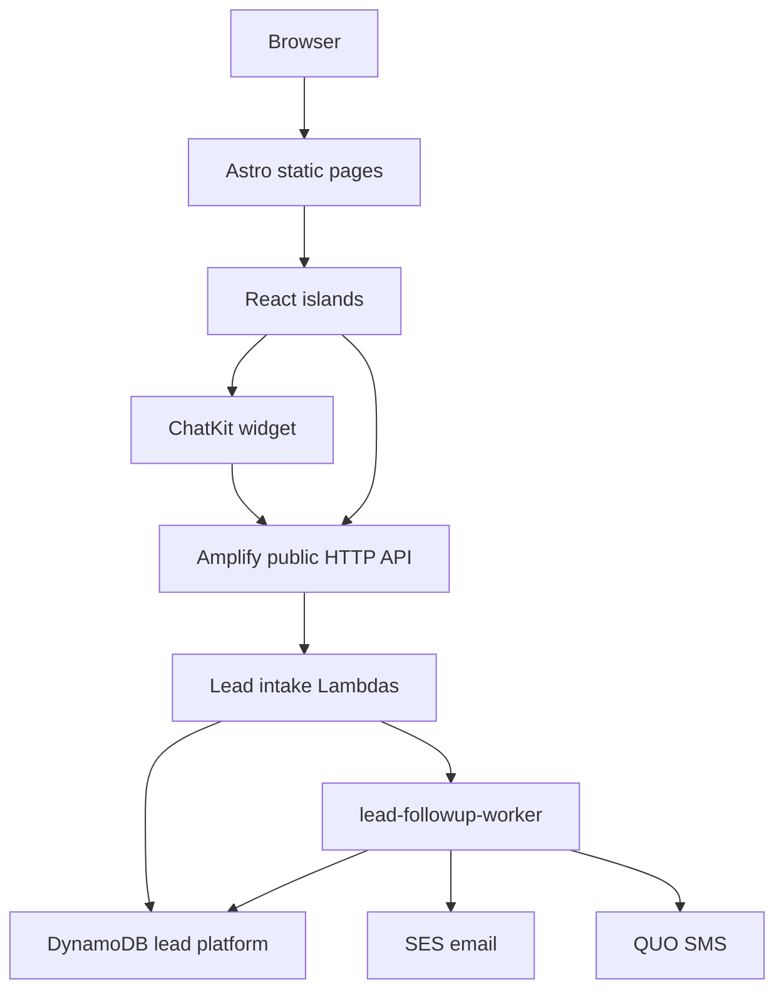
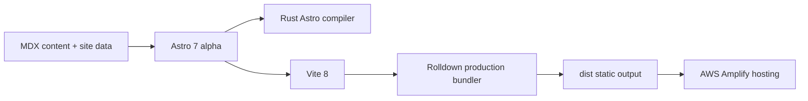

# Astro 7 Baseline Architecture

This site now treats Astro 7 alpha as the frontend build baseline. The important
runtime shift is not a page rewrite. It is a toolchain reset:

- Astro uses Vite 8.
- Vite 8 uses Rolldown as the production bundler.
- Astro 7 uses the Rust Astro compiler as the default compiler.
- Local browser behavior and AWS Amplify backend behavior remain separated.

References:

- Astro 7 alpha note: https://astro.build/blog/astro-620/#astro-v7-alpha
- Vite 8 announcement: https://vite.dev/blog/announcing-vite8

## What Changed

| Area | Before | Astro 7 baseline | Repo decision |
| --- | --- | --- | --- |
| Astro core | Astro 6 | Astro 7 alpha | Adopted in root `package.json` |
| Vite | Vite 7 under Astro | Vite 8 under Astro | Verified via lockfile and build |
| Production bundler | Rollup-oriented Vite build | Rolldown-powered Vite build | Removed legacy Rollup warning suppression |
| Astro compiler | Rust compiler was previously experimental in Astro | Rust compiler is the default in Astro 7 | No config flag needed |
| React island integration | `@astrojs/react` 5 | `@astrojs/react` 6 alpha | Adopted with Astro 7 |
| MDX integration | `@astrojs/mdx` 5 | `@astrojs/mdx` 6 alpha | Adopted with Astro 7 |
| Sitemap integration | Latest stable | Latest stable | Kept stable because the alpha tag is older |

## System Picture

## Build Pipeline Picture

## Refactor Direction

| Rule | Meaning for future work |
| --- | --- |
| Prefer Astro-native pages for static marketing content | Keep localized content and static rendering in Astro and MDX. |
| Keep React islands narrow | Use React for stateful quote, admin, and chat interactions only. |
| Avoid bundler-specific workarounds | Vite 8 provides a compatibility layer, but config should stay high-level unless a current failure proves otherwise. |
| Keep backend orchestration outside Astro | Lead capture, follow-up work, SES, QUO, and DynamoDB stay in Amplify functions. |
| Treat warnings as signal | Do not suppress Astro/Vite internals unless the current toolchain still reproduces the issue. |

## Verification Baseline

| Check | Expected result |
| --- | --- |
| `npm ci` | Clean lockfile install succeeds. |
| `npm run typecheck` | Web, node, and backend TypeScript checks pass. |
| `npm run build` | Astro 7/Vite 8 static build completes and admin guard passes. |
| `npm run test:backend` | Backend lead platform tests pass. |
| `npm run verify:amplify-deploy-compiler` | Amplify backend deploy compiler accepts the backend source. |

