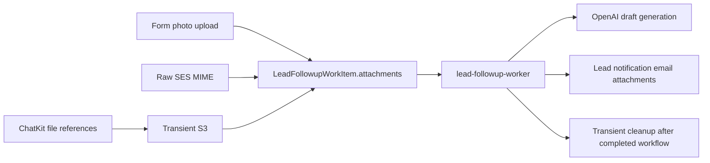
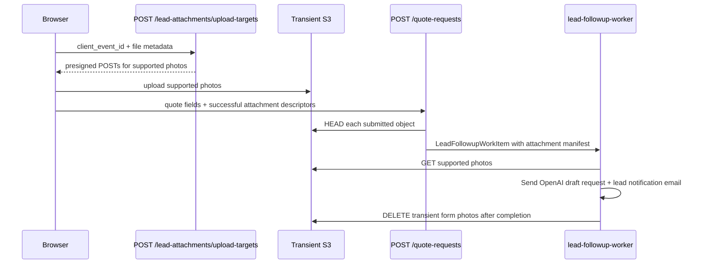
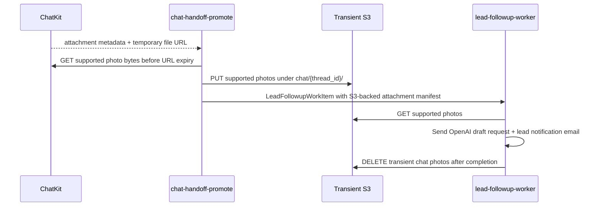

# Lead Photo Attachments

This runbook describes the shared lead photo attachment flow for form, email,
and chat intake.

## Policy

Supported v1 customer photo types:

| Type | MIME type | Notes |
| --- | --- | --- |
| JPEG | `image/jpeg` | Common iPhone/Android compatible export |
| PNG | `image/png` | Accepted for screenshots and simple images |
| WebP | `image/webp` | Accepted for modern Android/browser uploads |

Unsupported v1 examples: HEIC, GIF, PDF, ZIP, Word documents, empty files, and
files over the size limits.

| Limit | Value |
| --- | --- |
| Photos per lead | 4 |
| Max size per photo | 5 MB |
| Max total photo bytes | 12 MB |

Unsupported or failed photos are silently omitted. The text quote request must
continue whenever the form itself is valid.

## Shared Manifest

`LeadFollowupWorkItem.attachments` stores the photo manifest. There is no
attachment DynamoDB table in v1.

Generic counts are stored on follow-up work for all sources:

| Field | Meaning |
| --- | --- |
| `attachment_count` | Total customer-supplied attachment candidates for this source event |
| `photo_attachment_count` | Supported customer photos stored in the shared manifest |
| `unsupported_attachment_count` | Files omitted because type, size, count, total bytes, or upload validation failed |
| `inbound_photo_attachment_count` | Legacy email-specific count retained for compatibility |

## Source Behavior

| Source | Storage | Worker behavior | Cleanup |
| --- | --- | --- | --- |
| Form | Private transient S3 object under `form/{client_event_id}/` | Loads supported S3 photos into OpenAI as image data URLs and attaches them to lead notification email | Deletes form S3 objects after the workflow completes |
| Email | Raw SES MIME object | Reparses raw MIME, applies the same JPEG/PNG/WebP limits, and passes supported photos to OpenAI and lead notification email | Deletes raw MIME after the workflow completes |
| Chat | Private transient S3 object under `chat/{thread_id}/`, copied from the short-lived ChatKit file URL during handoff | Loads supported S3 photos into OpenAI as image data URLs and attaches them to lead notification email | Deletes chat S3 objects after the workflow completes |

## Form Upload Sequence

The upload target Lambda must keep presigned POSTs short-lived and constrained
by content type, exact key, metadata, and content-length range. Quote submit
must validate the uploaded object before trusting the descriptor.

## Chat Upload Sequence

Chat handoff must copy supported ChatKit photo bytes before reserving follow-up
work. ChatKit file URLs are temporary references and must not be treated as the
durable notification attachment source.

## Operational Notes

- The S3 bucket is transient transport, not a photo archive.
- The 1-day lifecycle rule is a backup for abandoned uploads, failed submits, or
  interrupted workflows. Successful workflows delete objects explicitly.
- Do not add user-facing warnings for unsupported files unless the business
  changes this policy.
- Keep photo type and size rules in
  `amplify/functions/_lead-platform/domain/lead-attachment.ts`; do not duplicate
  constants in frontend, email intake, or worker code.
