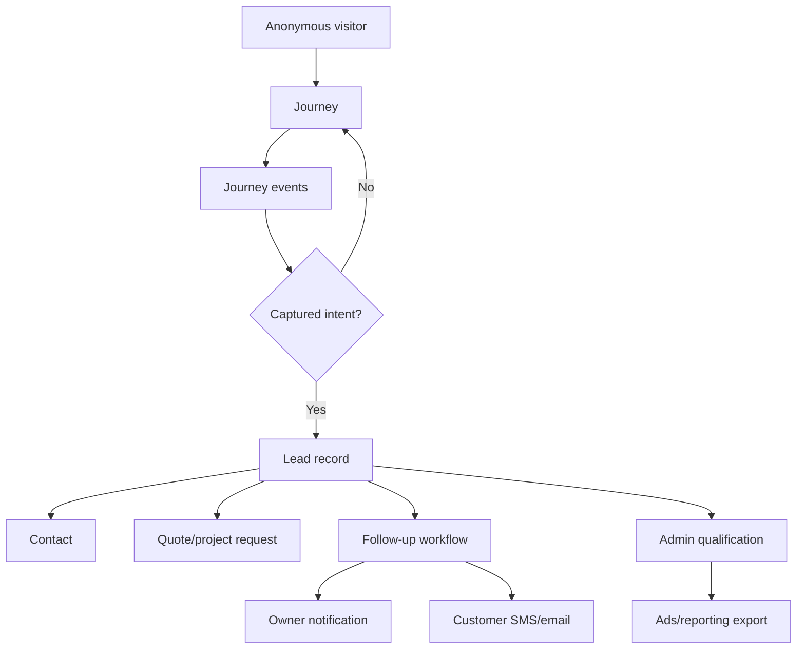

# Lead Platform Lifecycle Refactor Plan

Date: 2026-04-18

Status: active plan for Craig's lead-platform cleanup.

## Goal

Make Craig's lead system easier to change without future refactors by locking the
business lifecycle into code, tests, and docs.

Core rule:

```text
Visitor actions append to a journey.
Captured contact/project intent promotes the journey to a lead record.
Follow-up and qualification update the lead record and append workflow events.
```

This keeps GA4/GTM, quote forms, ChatKit, admin, QUO, SES, and future providers
as adapters around one lead model instead of separate lead models.

## Target Model



## Lifecycle Rules

Lifecycle rules live in `amplify/functions/_lead-platform/domain/lead-lifecycle.ts`.

| Phase | Meaning | Creates Lead Record | Requires Existing Lead |
| --- | --- | ---: | ---: |
| `journey_interaction` | Meaningful anonymous visitor action. | No | No |
| `lead_promotion` | Captured intent that should enter the shop work queue. | Yes | No |
| `lead_workflow` | System follow-up, dispatch, sync, or failure outcome. | No | Usually yes |
| `lead_verification` | Admin or offline qualification decision. | No | Yes |
| `diagnostic` | Invalid, blocked, or internal status event. | No | No |

Current promotion events:

| Event | Why It Promotes |
| --- | --- |
| `lead_form_submit_success` | Quote request has name plus phone/email validation. |
| `lead_chat_handoff_completed` | Chat handoff passed readiness gates and has lead context. |

Current journey-only interaction events:

| Event | Why It Stays Journey-Only |
| --- | --- |
| `lead_chat_first_message_sent` | Useful intent, but not necessarily enough identity. |
| `lead_click_to_call` | Intent signal, but no confirmed contact/project capture. |
| `lead_click_to_text` | Intent signal, but no confirmed contact/project capture. |
| `lead_click_email` | Intent signal, but no confirmed contact/project capture. |
| `lead_click_directions` | Intent signal, but no confirmed contact/project capture. |

## Refactoring Sequence

### Phase 1. Lock lifecycle semantics

Implementation:

- Add explicit lifecycle rules for every `JourneyEventName`.
- Make `lead-interaction-capture` import allowed interaction events from lifecycle rules.
- Add tests that prevent interaction events from creating lead records.
- Add tests that quote submit and completed chat handoff are the only promotion events.
- Add tests for browser retry dedupe by `client_event_id`.

Why:

- Future events cannot be added without declaring their lifecycle behavior.
- Tracking remains useful without polluting admin with fake leads.
- Promotion behavior becomes testable instead of implicit.

### Phase 2. Centralize interaction capture

Implementation:

- Keep browser tracking pointed at the public `/lead-interactions` route.
- Internally treat this as `lead-interaction-capture`.
- Ensure it only appends journey events and upserts anonymous journeys.
- Preserve `journey_id`, attribution, locale, page URL, and `client_event_id`.
- Do not create contacts or lead records in this path.

Why:

- Broad analytics stays in GA4/GTM.
- Operational lead-intent events stay in the lead platform.
- Admin can show timeline context without turning every click into a lead.

### Phase 3. Centralize promotion services

Implementation:

- Keep quote submit promotion in `_lead-platform/services/quote-request.ts`.
- Keep chat promotion in `_lead-platform/services/intake-chat.ts` until it can be renamed cleanly.
- Introduce shared promotion helpers only when quote and chat need the same behavior.
- Keep contact normalization and merge logic in named lead-core services:
  - `_lead-platform/services/contact-identity.ts`
  - `_lead-platform/services/journey-status.ts`
  - `_lead-platform/services/journey-events.ts`
  - `_lead-platform/services/qualification.ts`
  - `_lead-platform/services/merge-journey.ts`
  - `_lead-platform/services/merge-lead-record.ts`

Why:

- Quote and chat are different intake sources, but they should create the same lead model.
- Premature unification could hide important differences in transcript/project handling.
- Shared behavior should emerge from tested duplication, not naming preference.

### Phase 4. Follow-up workflow cleanup

Implementation:

- Keep public submit Lambdas thin: validate, persist, enqueue.
- Keep async workers responsible for owner/customer notification and provider calls.
- Move provider-neutral follow-up state transitions into shared lead-core services.
- Treat QUO and SES as adapters.
- Store failed/skipped/sent outcomes as workflow events and latest outreach snapshots.

Why:

- QUO may be unavailable, disabled, or replaced.
- SES may fail independently of quote capture.
- Manual follow-up should be represented as an operational outcome, not an error storm.

### Phase 5. Admin and reporting lifecycle

Implementation:

- Qualification updates lead records and appends journey events.
- Managed-conversion feedback status remains separate from qualification status.
- Admin should read lead records as the work queue and journeys as the timeline.
- Export scripts should consume lead records, not legacy case tables.

Why:

- A qualified lead is a business decision.
- A provider feedback upload is a managed-conversion outcome state.
- Keeping those separate prevents reporting rewrites.

### Phase 6. Source renaming and hard breaks

Implementation:

- Rename internal concepts after semantics are enforced by tests.
- Prefer new names such as `lead-interaction-capture`, `quote-request-submit`,
  `lead-followup`, `lead-admin`, and `lead-action-link`.
- Keep public HTTP routes stable only when changing them would create avoidable GTM/GA churn.
- Delete old wrapper modules and docs in the same slice as each rename.

Why:

- Names should follow enforced behavior.
- Hard breaks are acceptable in this project, but only when cleanup is complete.
- Stable public routes reduce unnecessary production coordination.

## Edge Case Testing Matrix

| Edge Case | Expected Behavior | Test Location |
| --- | --- | --- |
| Unknown event name | Return `400 Invalid event`; no journey or event written. | `lead-interaction-capture/handler.test.ts` |
| Invalid JSON | Return `400 Invalid JSON body`; no write. | public API smoke tests |
| Retried browser event | Same `client_event_id` records one event; response says `recorded:false` on retry. | `lead-interaction-capture/handler.test.ts` |
| Missing `journey_id` | Create stable fallback journey from thread/user/page/click/time. | `record-interaction` tests |
| Click-to-call/text/email/directions | Append journey event only; no contact and no lead record. | lifecycle and signal tests |
| First chat message | Append soft-intent journey event only. | lifecycle tests |
| Quote submit success | Create or update contact, journey, lead record, and quote request. | quote-request-submit and quote-request tests |
| Chat handoff completed | Promote journey to lead record after readiness gates. | intake-chat tests |
| Chat handoff blocked/deferred/error | Append workflow/diagnostic event; do not create a lead. | workflow-event tests |
| Honeypot quote request | Return benign success; do not queue follow-up or create lead. | quote-request-submit tests |
| Duplicate quote submit | Stable journey/lead IDs prevent duplicate lead records for same journey. | intake-form tests |
| Worker invocation failure | Mark quote request error and return a submit failure. | quote flow tests |
| QUO disabled | Mark manual follow-up required, not SMS failure. | lead-followup-worker tests |
| SMS failure with email fallback | Send email fallback and persist outcome. | lead-followup-worker tests |
| SMS failure with no email | Persist failure and notify owner. | lead-followup-worker tests |
| Owner email failure | Mark follow-up error and preserve diagnostic detail. | lead-followup-worker tests |
| Admin qualifies lead | Update lead record and append verification event. | lead-admin tests |
| Ads upload later succeeds/fails | Update upload state separately from qualification. | future export tests |
| Contact submits phone then later email | Merge contact identity by normalized phone/email. | contact repo tests |
| Chat then form from same journey | Reuse journey-derived lead record identity. | intake-chat and intake-form tests |
| Local storage unavailable | Browser should best-effort create a journey and never block UX. | future browser tests |
| Multiple tabs | Same journey can receive multiple deduped events. | future browser tests |
| Bot/bad payload | No real lead record; diagnostic only if useful. | quote-request-submit tests |

## Cleanup Process

Every refactor slice must include cleanup in the same commit.

Checklist:

- Search for old names with `rg`.
- Delete obsolete wrapper modules after imports are moved.
- Move tests to the new owning module, not just update imports.
- Do not recreate catch-all `domain/types.ts` or `services/shared.ts`; create or update the module that owns the behavior.
- Update `AGENTS.md` and relevant runbooks when ownership changes.
- Run `npm run predeploy`.
- Run `npm run build` when frontend, Astro, or shared browser output changes.
- If backend/runtime code changed, push and wait for Amplify build/deploy/verify.
- Run live non-mutating smoke tests after deploy.
- Confirm `git status --short --branch` is clean.

## Non-Goals

- Do not upload every GA4 event into the lead platform.
- Do not turn every click into a lead record.
- Do not couple lead lifecycle to QUO, SES, ChatKit, Google Ads, or any other paid acquisition provider detail.
- Do not preserve old internal names only for historical continuity.
