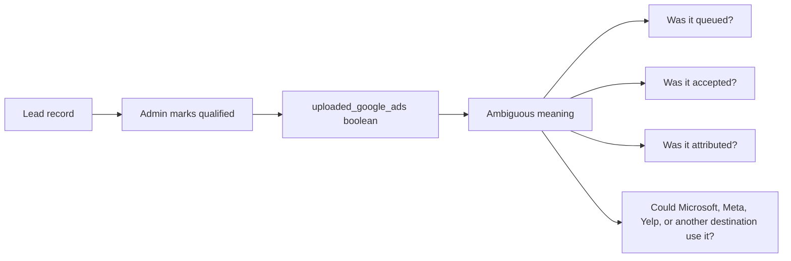
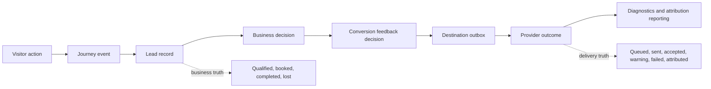
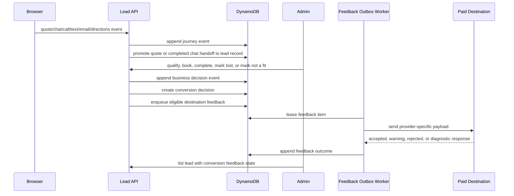

# Managed Conversions Architecture

Date: 2026-04-19

## Why This Exists

Craig's lead platform should not treat Google Ads upload state as lead truth. A lead can be
qualified, unqualified, booked, completed, or lost regardless of whether any ad platform accepts
conversion feedback later.

The production model is:

```text
visitor behavior -> journey events -> lead record -> business decision -> conversion feedback destinations
```

Google Ads is one destination for managed conversion feedback. It is not the lead lifecycle and it
is not the internal source of truth.

## Visual Mental Model

The old model looked simple, but it hid three different questions inside one field:



The new model is more explicit:



The practical difference is ownership. The lead platform owns the customer and job state. Provider
destinations own whether their advertising systems can use the feedback. That boundary prevents
Google Ads, Microsoft Ads, Meta Ads, Yelp, or any future paid channel from defining what a real lead
is.

## Provider Research That Changes The Model

The major paid acquisition platforms all support some form of server-side or offline conversion
feedback, but they do not share the same payload shape:

| Destination | Common matching signals | Important implementation constraint |
| --- | --- | --- |
| Google Ads / Google Data Manager | `gclid`, `gbraid`, `wbraid`, hashed email, hashed phone, consent, conversion action, order ID | Successful upload does not guarantee attribution; diagnostics and attribution must be tracked separately. |
| Microsoft Ads | `msclkid`, hashed email, hashed phone, conversion goal name, UTC conversion time | Duplicate rules are tied to click ID and conversion time; enhanced conversions can work without `msclkid` when hashed identity is present. |
| Meta Ads | `fbclid`, `_fbc`, `_fbp`, hashed identity, IP, user agent, `event_id`, `action_source` | `event_id` is critical for deduplication between browser and server events. |
| TikTok Ads | `ttclid`, `_ttp`, hashed identity, event ID, pixel context | Browser pixel and Events API/Gateway should dedupe by event IDs or TikTok cookie signals. |
| LinkedIn Ads | hashed email, `li_fat_id`, conversion rules, external IDs | The destination depends on a configured conversion rule, not just a generic upload flag. |
| Pinterest Ads | `epik`, hashed email, event ID, order ID, value/currency | Events should be sent close to real time and deduped when tag and API both run. |
| Snap Ads | `ScCid` / `sc_click_id`, `_scid`, hashed email, hashed phone, event ID | Event IDs and normalized hashed identifiers are needed for reliable dedupe and matching. |
| Yelp Ads | hashed email, hashed phone, IP/user agent, Yelp lead ID, event ID | Yelp can receive server-side events and dedupe on `event_id` + event name. |

### Research Notes By Destination

| Destination | What the docs imply for Craig's | Required design response |
| --- | --- | --- |
| Google Ads / Data Manager | Google strongly favors enhanced conversions for leads, meaning first-party identity can be useful even when a click ID is missing. Google also separates upload success from later attribution and diagnostics. | Store click IDs, identity availability, consent, conversion action, order/event ID, upload response, and later diagnostics separately. Do not collapse them into one boolean. |
| Microsoft Ads | Microsoft can use `msclkid`, but enhanced conversions can also use hashed email or phone. Conversion time and goal name matter, and duplicates are evaluated against click ID and conversion time. | Store destination goal names and event timestamps. The outbox item needs a stable event ID and destination payload hash so retries do not create duplicates. |
| Meta Ads | Meta's Conversions API needs event name, event time, user data, action source, and dedupe fields such as `event_id`. Browser and server events can both exist. | Browser tracking and server feedback must share a dedupe ID. Admin qualification alone is not enough to build a valid event. |
| TikTok Ads | TikTok emphasizes Events API or Events API Gateway paired with pixel/browser context. `_ttp`, `ttclid`, and event ID can help matching and dedupe. | Capture browser IDs and click IDs in the attribution snapshot. Keep TikTok as a destination adapter, not a lead-platform dependency. |
| LinkedIn Ads | LinkedIn conversion feedback depends on configured conversion rules and identifiers such as hashed email, external IDs, or `li_fat_id`. | Destination configuration must know the LinkedIn conversion rule. A generic "uploaded" flag cannot explain whether the correct rule was used. |
| Pinterest Ads | Pinterest stresses real-time delivery, enhanced match, event ID dedupe, and event quality. | Store event quality inputs and send close to the business decision time when possible. If feedback is delayed, the outcome should show that delay. |
| Snap Ads | Snap requires careful normalization and hashing. It also supports offline events and dedupe across Pixel and Conversions API using event IDs. | Normalize/hide PII before provider upload. Event IDs need to be stable across retries and across browser/server paths. |
| Yelp Ads | Yelp supports server-side conversion events, hashed identity, lead IDs, and event dedupe. It may matter for local services where customers call or message before booking. | The model must support non-social local paid providers. Treat Yelp as a paid acquisition feedback destination, not a referral-only source. |

Official references:

- [Google Ads API conversion management](https://developers.google.com/google-ads/api/docs/conversions/overview)
- [Google enhanced conversions for leads](https://developers.google.com/google-ads/api/docs/conversions/enhanced-conversions/leads-setup)
- [Google Data Manager events](https://developers.google.com/data-manager/api/devguides/events)
- [Microsoft Advertising OfflineConversion](https://learn.microsoft.com/en-us/advertising/campaign-management-service/offlineconversion?view=bingads-13)
- [Microsoft Advertising ApplyOfflineConversions](https://learn.microsoft.com/en-us/advertising/campaign-management-service/applyofflineconversions?view=bingads-13)
- [Meta Conversions API](https://developers.facebook.com/docs/marketing-api/conversions-api/)
- [TikTok Events API Gateway](https://ads.tiktok.com/help/article/about-events-api-gateway)
- [LinkedIn Conversions API](https://learn.microsoft.com/en-us/linkedin/marketing/integrations/ads-reporting/conversions-api?view=li-lms-2026-04)
- [Pinterest Conversions API](https://help.pinterest.com/en/business/article/the-pinterest-api-for-conversions)
- [Snap Conversions API parameters](https://developers.snap.com/api/marketing-api/Conversions-API/Parameters)
- [Yelp Conversions API](https://docs.developer.yelp.com/docs/conversions-api)

## Before And After

| Before | After |
| --- | --- |
| `LeadQualificationSnapshot` stored `uploaded_google_ads`. | Qualification stores only the business decision: qualified or not qualified. |
| Admin displayed a `Google Ads` column. | Admin displays provider-neutral `Conversion Feedback` readiness. |
| One boolean tried to represent upload, acceptance, and attribution. | Feedback has statuses: not ready, needs signal, needs destination config, ready, queued, manual, sent, accepted, warning, failed, attributed, suppressed, retracted. |
| Attribution primarily captured Google/Microsoft/Meta/TikTok click IDs. | Attribution also captures LinkedIn, Pinterest, Snap, Yelp, and browser IDs used by server-side feedback loops. |
| A future non-Google provider would require another lead-record refactor. | New destinations attach behind the managed-conversion contract without changing lead truth. |

### Before And After Data Ownership

| Layer | Before | After | Why Better |
| --- | --- | --- | --- |
| Website | Captured form/chat/click events and sent attribution, but provider-specific future use was implicit. | Captures journey actions plus a broader attribution snapshot with provider-neutral signal keys. | Website behavior stays simple. It records what happened, not what every ad provider might need later. |
| Lead record | Included qualification and Google upload state together. | Stores contact, journey, project, outreach, and qualification only. | The lead record remains stable even when provider APIs, credentials, or campaign strategy change. |
| Admin | Presented "Google Ads" as if it were the managed-conversion goal. | Presents "Conversion Feedback" readiness. | The human reviewer sees whether the lead is ready for feedback without being taught the wrong mental model. |
| Provider logic | Future code would have had to infer provider actions from lead fields. | Future workers consume explicit destination configuration and outbox items. | Provider additions become adapter work rather than core lead-platform rewrites. |
| Reporting | A single boolean could not distinguish queued, sent, accepted, warning, failed, or attributed. | Feedback outcomes carry state and diagnostics per destination. | Operations can answer "what failed" and "what was accepted but not attributed." |

## Current Source Of Truth

The shared contract lives in:

- `packages/contracts/src/managed-conversion-contract.js`
- `packages/contracts/src/managed-conversion-contract.d.ts`

It owns:

- supported feedback destination keys
- destination labels
- click ID and browser ID signal requirements
- feedback statuses
- decision types
- provider-neutral readiness summary logic

The admin view consumes the summary. It should never infer that a qualified lead has already been
uploaded, accepted, or attributed unless a provider outcome record says so.

Admin readiness can be scoped with:

```text
MANAGED_CONVERSION_DESTINATIONS=google_ads,microsoft_ads,meta_ads
```

If this is empty, a qualified lead with signals will show that destination configuration is still
needed instead of pretending that a provider upload is pending.

### Contract Responsibilities

| Contract area | Current implementation | Future extension point |
| --- | --- | --- |
| Destination keys | `google_ads`, `microsoft_ads`, `meta_ads`, `tiktok_ads`, `linkedin_ads`, `pinterest_ads`, `snap_ads`, `yelp_ads`, `manual_export` | Add new destinations only here first, then add an adapter. |
| Matching signals | Click IDs, browser IDs, and first-party identity availability | Add consent, address hashing readiness, IP/user-agent availability, and platform-specific event quality fields. |
| Readiness statuses | `not_ready`, `needs_signal`, `needs_destination_config`, `ready` plus future outcome statuses | Split readiness from durable delivery outcomes once outbox tables exist. |
| Admin summary | Human-readable status, reason, destinations, and signal keys | Add last outcome, last attempted time, error class, and diagnostics link. |
| Decision types | Qualified lead, booked job, completed job, lost lead, spam, not a fit | Add quote value, job value, and lifecycle-specific conversion values. |

This contract is intentionally small. It should not become a provider SDK wrapper. Its job is to
define Craig's vocabulary and signal model so the rest of the codebase can speak consistently.
Provider adapters can translate from this contract into each platform's required payload.

## Implementation Rule

Use three separate concepts:

| Concept | Meaning | Example |
| --- | --- | --- |
| Lead record | Customer/job truth. | "This quote request is qualified." |
| Conversion decision | Business feedback worth sending. | "Send qualified lead feedback." |
| Feedback outcome | Destination-specific delivery result. | "Google accepted the event with warning X." |

Provider outcomes are evidence about delivery and attribution. They are not the lead lifecycle.

## Target Data Flow

The desired production flow after the next slice is:



This flow gives us four debugging handles:

- Journey events explain how the customer arrived and what they did.
- Lead records explain the current business state.
- Conversion decisions explain what Craig's chose to tell acquisition platforms.
- Feedback outcomes explain what each destination did with that information.

Without those handles, every production issue becomes a guess. With those handles, a reviewer can
answer whether the website captured the lead, whether the shop qualified it, whether it was eligible
for feedback, whether it was sent, and whether the destination accepted or attributed it.

## Status Semantics

| Status | Owner | Meaning | Example admin copy |
| --- | --- | --- | --- |
| `not_ready` | Lead platform | The business decision has not happened yet. | "Lead must be qualified before conversion feedback is evaluated." |
| `needs_signal` | Contract/readiness | The lead is qualified but has no usable click, browser, email, or phone signal for the configured destination. | "Qualified lead has no provider matching signal." |
| `needs_destination_config` | Operations/config | The lead has usable signals, but no destinations are configured. | "Configure destination." |
| `ready` | Contract/readiness | At least one configured destination has enough signal. | "Ready." |
| `validated` | Worker/provider adapter | A destination payload was built locally or accepted by a provider test/validation mode without live conversion upload. | "Validated for Google Ads dry run." |
| `queued` | Outbox | A feedback item exists and is waiting for a worker. | "Queued for Microsoft Ads." |
| `manual` | Worker/manual adapter | The worker found a manual destination and recorded that no provider API was called. | "Ready for manual export." |
| `sent` | Worker | The worker made a request and is waiting for final interpretation or diagnostics. | "Sent to Meta Ads." |
| `accepted` | Provider outcome | The destination accepted the event. This is not the same as attribution. | "Accepted by Google Ads." |
| `warning` | Provider outcome | The destination accepted or partially accepted the event with a warning. | "Accepted with diagnostics warning." |
| `failed` | Provider outcome | The destination rejected the request or the worker exhausted retries. | "Failed: invalid conversion action." |
| `attributed` | Reporting/diagnostics | The destination later reports that the event matched/attributed. | "Attributed in diagnostics." |
| `suppressed` | Lead platform | Feedback should not be sent, usually because the lead is spam, not a fit, or missing consent. | "Suppressed by business decision." |
| `retracted` | Lead platform/provider | A prior decision was reversed or adjusted. | "Retracted after unqualification." |

## Edge Cases To Preserve

| Edge case | Why it matters | Correct behavior |
| --- | --- | --- |
| Qualified direct lead with email only | Google, Microsoft, Meta, Snap, Pinterest, and Yelp-style APIs may still use hashed first-party identity. | Do not reject just because no click ID exists. Mark ready only for destinations that support identity matching and are configured. |
| Google click ID but no Google destination configured | The signal exists, but operations has not configured the feedback destination. | Show `needs_destination_config`, not `pending upload`. |
| Microsoft `msclkid` lead | This should not be hidden behind a Google column. | Candidate destination should be Microsoft Ads. Admin should display provider-neutral feedback readiness. |
| Meta browser plus server event | Browser and server events can double count without a shared event ID. | Use stable event IDs for browser and outbox paths before enabling provider delivery. |
| Admin double-clicks Qualify | Duplicate verification events pollute timelines and can create duplicate feedback decisions. | Repeating the same qualification state should be idempotent. |
| Accepted but not attributed | Many providers can accept an upload that later does not match a click or user. | Store accepted and attributed separately. Acceptance is delivery truth, attribution is reporting truth. |
| Provider disabled | QUO and paid destination credentials may not be ready. | Disabled provider state should produce a manual or configuration-needed outcome, not a lead failure. |
| Lead later becomes spam or not a fit | Business truth can change after feedback is queued or sent. | Future implementation needs suppression, retraction, or adjustment states. |
| Multiple providers eligible | A lead might have Google click ID, Meta browser ID, and email. | The outbox should support multiple destination items from one decision. |
| No historical compatibility needed | Craig's is treated as unreleased software. | Prefer clean v2 data shapes over compatibility wrappers. |

## What The Current Implementation Does Now

The current implementation includes the durable foundation, the safe worker loop, and a provider
adapter framework. Google Ads and Yelp can run locally in `dry_run`, call provider validation/test
modes, or send live feedback when credentials are configured:

| Area | Implemented now | Not implemented yet |
| --- | --- | --- |
| Contract | Destination keys, signal extraction, readiness summary, status vocabulary including `manual` and `validated` | Diagnostics-state contracts and richer event-value policy |
| Attribution | Captures Google, Microsoft, Meta, TikTok, LinkedIn, Pinterest, Snap, Yelp, and browser IDs | IP/user-agent storage policy and consent policy beyond current provider config |
| Lead qualification | Stores only `qualified` and `qualified_at_ms`; qualification creates a durable conversion decision when appropriate | Booked/completed/lost decision UI |
| Durable storage | Creates `LeadConversionDecisions`, `LeadConversionFeedbackOutbox`, `LeadConversionFeedbackOutcomes`, and `ProviderConversionDestinations` | Provider diagnostics polling |
| Worker | Scheduled `managed-conversion-feedback-worker` leases queued outbox items, records outcomes, retries transient adapter failures, suppresses inactive decisions, handles `manual_export`, and delegates provider delivery through a registry | Admin retry controls and diagnostics polling |
| Provider framework | Shared adapter types, mode parsing, HTTP execution, response mapping, and identity normalization live under `services/conversion-feedback/` | Admin-editable destination configuration |
| Google Ads adapter | Builds REST `uploadClickConversions` payloads, applies Google-specific email/phone normalization, supports `dry_run`, `test`/`validateOnly`, and `live`, and maps provider responses into outcomes | Real credential configuration and production smoke tests |
| Yelp adapter | Builds Yelp Conversions API event payloads, hashes Yelp-compatible identifiers, supports `dry_run`, `test_event`, and `live`, and maps `202`, auth/config errors, and retryable failures into outcomes | Yelp API access approval and production smoke tests |
| Admin | Shows provider-neutral readiness plus expandable decision, destination outbox, latest outcome, attempt, lease, retry, error, provider-response, and diagnostics detail | Retry controls and richer decision types |
| API routes | Removes unimplemented notes/follow-up routes from public contract | New admin conversion-decision routes for booked/completed/lost/spam/not-a-fit |
| Tests | Covers contract parsing, signal readiness, attribution capture, durable decision idempotency, suppression, conditional leasing, manual export, Google/Yelp payload validation, provider test/live HTTP paths with mocked clients, missing adapters, retries, and backend regression paths | Live provider sandbox tests |

This is the correct stopping point for this slice because it proves the operational loop without
pretending that provider acceptance means attribution. The provider framework follows the documented
Google Ads `uploadClickConversions` and Yelp Conversions API event shapes enough to validate Craig's
internal signal, hashing, event ID, consent/config, and conversion-action wiring. Live API execution
is available only when provider credentials are explicitly configured.

## Future Tables And Ownership

The durable storage slice has been implemented with clear ownership:

| Table | Primary owner | Purpose | Key idempotency rule |
| --- | --- | --- | --- |
| `LeadConversionDecisions` | Lead platform | Records a business decision worth sending as feedback. | One decision ID per lead record, decision type, and decision time. |
| `LeadConversionFeedbackOutbox` | Worker system | Queue of destination-specific feedback sends. | One outbox item per decision ID and destination key. |
| `LeadConversionFeedbackOutcomes` | Provider adapters | Immutable outcomes from provider send attempts and diagnostics checks. | Append-only by outbox item ID, attempt number, and provider response ID if present. |
| `ProviderConversionDestinations` | Operations/config | Destination settings such as account ID, conversion action, goal name, rule ID, pixel ID, or enabled state. | One active config per destination key and environment unless intentionally versioned. |

These names are intentionally business-oriented. They do not say "Google integration" because Google
is one destination, not the architecture.

## Design Principles

| Principle | Practical meaning |
| --- | --- |
| Business truth first | Qualification, booking, completion, and loss belong to Craig's, not to an ad platform. |
| Provider outcomes are append-only evidence | A provider response should not rewrite the meaning of a lead. It should add evidence about delivery, matching, and diagnostics. |
| Idempotency is a product requirement | Admin retries, Lambda retries, browser retries, and provider retries must not create duplicate conversions. |
| Capture raw availability, send only normalized allowed data | The platform can know that email or phone exists without exposing plaintext PII to every destination. Provider adapters should normalize and hash only when sending. |
| Configuration is explicit | If a destination has no conversion action, goal name, pixel ID, or token, the system should say configuration is missing. It should not pretend the upload is pending. |
| Provider-neutral admin language | The admin should teach reviewers the correct workflow: qualify leads and manage conversion feedback. It should not train them to think every feedback loop is Google Ads. |

## Future Work

The next production slice should activate and smoke-test provider execution:

- Configure real Google Ads credentials and run `test`/`validateOnly` before switching to `live`.
- Confirm whether Yelp Conversions API access is available for Craig's account; Yelp's docs note access may require Yelp sales/client-success approval and may target larger multi-location advertisers.
- Run Yelp `test_event` before switching to `live`.
- Store provider response IDs, warning/error codes, diagnostics URLs, and retry metadata in `LeadConversionFeedbackOutcomes`.
- Add admin retry controls and decision types beyond `qualified_lead`.
- Add booked/completed/lost/spam/not-a-fit decisions before assigning conversion value or uploading revenue-oriented events.

Until a provider adapter is live, admin should treat `queued`, `manual`, and
`needs_destination_config` feedback as durable internal workflow state. It should treat `validated`
as proof that Craig's can construct the provider payload or pass provider test validation, not as
proof that any ad platform attributed a conversion.
